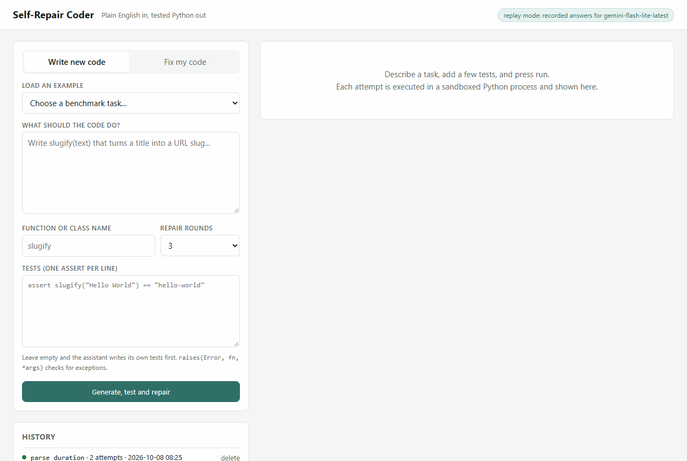
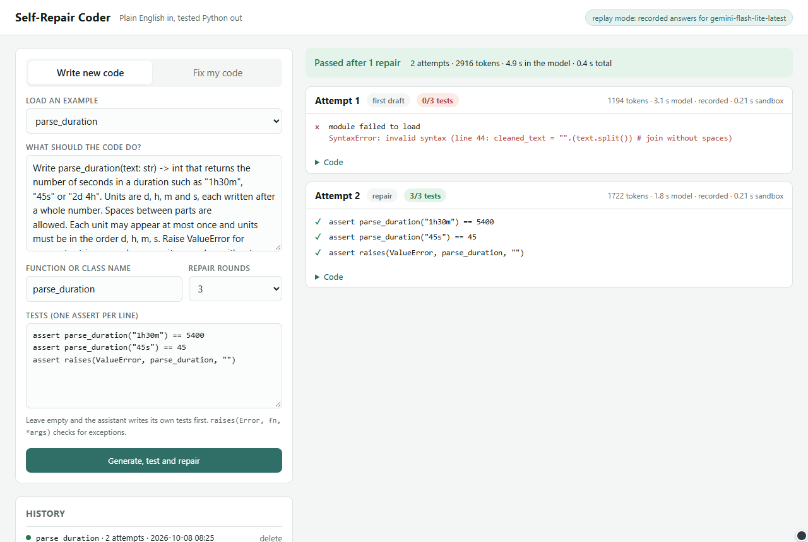
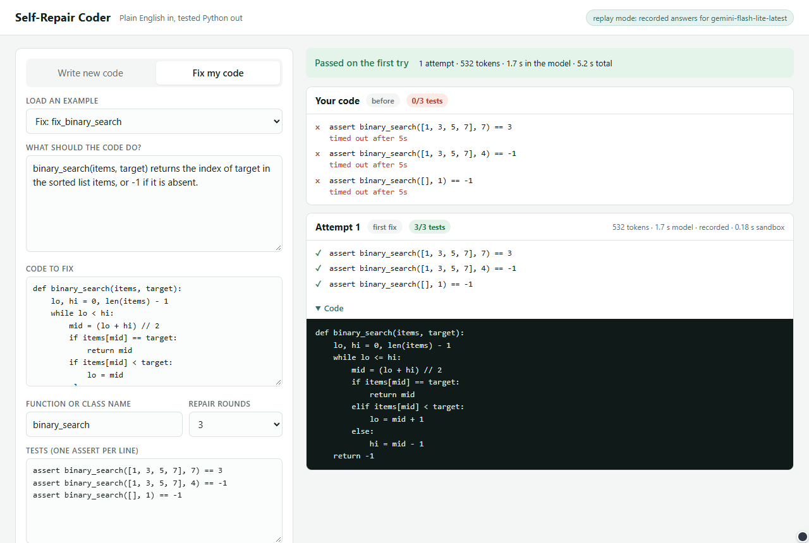
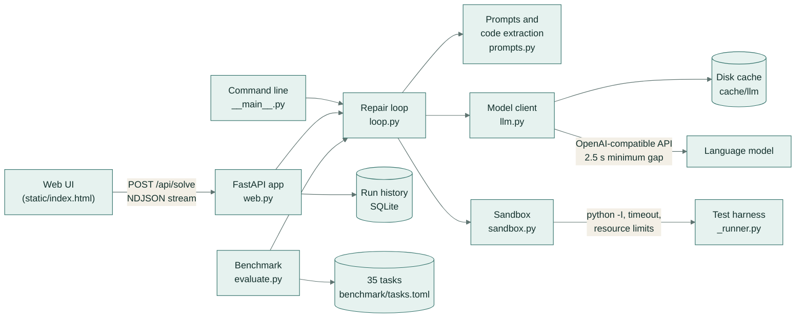
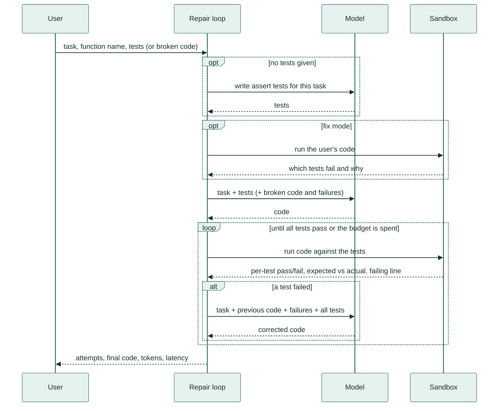
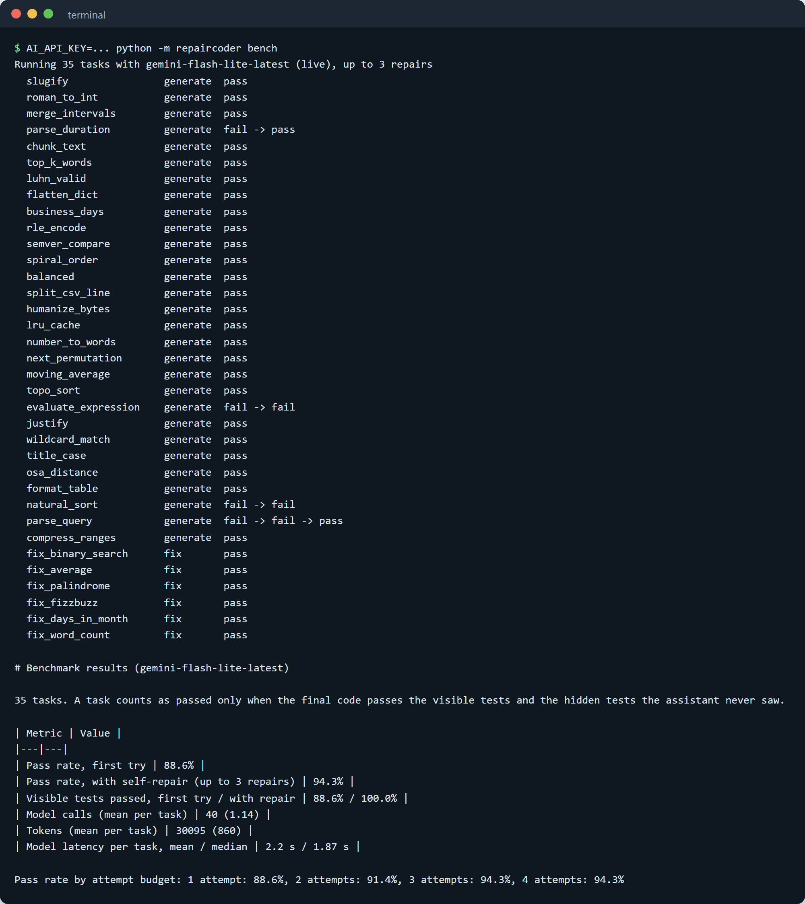
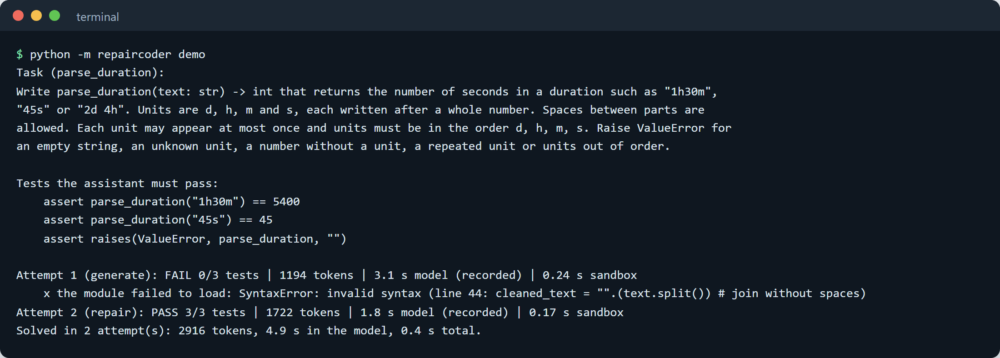

# Self-Repair Coder

An AI coding assistant that turns a plain-English task into working, tested Python. It writes the code, runs it
against your tests in a sandboxed process with a time limit, reads the failures and repairs its own code until
the tests pass.



## What it does

You describe a function in plain English and give a few checks that say what "correct" means (in Python these
are one-line `assert` statements, such as `assert add(2, 2) == 4`). The assistant:

1. asks a language model for a first draft;
2. runs that draft in a separate, time-limited Python process against your tests;
3. if anything fails, sends the model its own code with the exact failures, for example
   `expected 0, got -1` or `SyntaxError: invalid syntax (line 44: ...)`;
4. repeats until every test passes or the repair budget runs out.

It also has a **Fix my code** mode: paste broken code, and it first runs your code to show which tests fail,
then fixes it. If you give no tests at all, the assistant writes its own tests from the description first.

Every run shows how many tests passed at each attempt, the tokens used and the time spent in the model and in
the sandbox. Runs are saved in a history list so you can reopen them.

**Key features**

- Generate, test and repair loop, with a configurable number of repair rounds.
- Sandboxed execution: a fresh isolated interpreter, a throwaway folder, a wall-clock timeout, sockets disabled,
  and CPU, memory, file-size and process limits on Linux and macOS.
- Failure reports a model can act on: the expected and actual value for `assert a == b`, and the failing
  solution line for crashes and syntax errors.
- A 35-task benchmark with hidden tests the assistant never sees, scored for first-try versus self-repair pass
  rate, tokens and latency.
- Works with any OpenAI-compatible endpoint; without an API key it replays recorded answers, so the demo, the
  web UI examples and the benchmark all run offline.
- Web UI that streams each attempt as it happens, a command line, and a JSON API.

## A real-life example

Maya runs reporting at Acme Logistics. She needs a helper that turns the duration strings drivers type into
the delivery app ("1h30m", "2d 4h", "45s") into seconds, and it must reject junk such as "5x" or "1m1m".

She writes two sentences about the format, adds three asserts (`"1h30m"` is 5400, `"45s"` is 45 and an empty
string raises `ValueError`) and presses **Generate, test and repair**.

- The first draft does not even load: the model wrote `"".(text.split())`, a syntax error on line 44.
- The sandbox reports exactly that line. The repair fixes it and all three tests pass.
- Maya copies the final function into her script. She also has a record of how it was tested: two attempts,
  2,916 tokens and about 5 seconds of model time.



## How you would use it

1. Start the app (one command, see [Setup](#setup)) and open http://127.0.0.1:8000 in your browser.
2. Describe what the function should do, in a sentence or two, and give it a name.
3. Paste a few checks, one per line, or leave the box empty and the assistant writes its own.
4. Press **Generate, test and repair** and watch each attempt appear: which checks passed, what failed and why,
   and the corrected version.
5. Copy the final code from the page. The run is kept in the history list, so you can show how it was tested.

Have code that already exists but doesn't work? Choose **Fix my code**, paste it in, and it is tested and repaired
the same way. Developers can do all of this from the command line too (see [Usage](#usage)).



## Architecture



## How it works



Step by step:

1. **Tests.** Your asserts are split one per line. An indented line continues the test above it, and a line can
   hold several statements joined by `;`. With no tests, the model is asked for 6 to 8 one-line asserts first.
2. **First draft.** The model gets a system prompt asking for one standard-library module in a single Python code
   block, plus the task and the tests. In fix mode it also gets your code and the failures from running it.
3. **Code extraction.** The fenced block that defines the requested function or class is taken from the reply.
4. **Sandboxed run.** The code and tests are written to a temporary folder and run by `_runner.py` in a new
   `python -I` process with a minimal environment. Each test runs on its own, and its result is written as a
   JSON line as soon as it finishes, so a timeout still keeps the earlier results.
5. **Failure report.** For `assert a == b` the harness evaluates both sides and reports
   `expected <b>, got <a>`. For crashes it names the failing solution line, and for syntax errors the line and
   its text.
6. **Repair.** The model gets the task, its previous code, the failures and all the tests, and is asked for the
   root cause and a complete corrected module. Steps 4 to 6 repeat up to the repair budget (3 by default).
7. **Record.** Every model call's prompt tokens, completion tokens and latency are added up. The web UI saves the
   run in SQLite for the history list.

### The sandbox

| Protection | How |
|---|---|
| Isolated interpreter | `python -I`: no user site-packages, no `PYTHON*` variables, script folder not on `sys.path` |
| Clean working folder | a new temporary folder per run, removed afterwards |
| Minimal environment | only `PATH`, `SYSTEMROOT` (needed on Windows) and fixed Python settings are passed in |
| Time limit | wall-clock timeout (5 s by default), then the process is killed |
| Resource limits (Linux, macOS) | CPU seconds, 512 MB address space, 1 MB file size, 256 processes |
| No network | `socket.socket` and `socket.create_connection` raise inside the harness |

This contains the errors a model's code can make: infinite loops, crashes and runaway memory. It is not a security
boundary against deliberately hostile code; for that, run the service inside a container or VM.

## Evaluation

The benchmark has 35 hand-written tasks in `benchmark/tasks.toml`:

- 20 everyday functions, such as a slugifier, Roman numerals, interval merging, an LRU cache and topological sort;
- 9 harder tasks with exact conventions, such as an expression parser with right-associative `^`, text
  justification, wildcard matching with escapes and natural sort;
- 6 fix tasks with broken starter code, such as an off-by-one binary search, a leap-year bug and a mutable
  default argument.

Each task has **visible tests**, which the assistant sees and repairs against, and **hidden tests**, which it
never sees. A task counts as passed only when the code passes both. Every task also has a reference solution,
and the test suite checks that each reference passes all of its tests and that each broken starter fails.

Results for `gemini-flash-lite-latest` at temperature 0, with up to 3 repairs (`eval/results.md`):

| Metric | Value |
|---|---|
| Pass rate, first try | **88.6%** (31 of 35) |
| Pass rate, with self-repair | **94.3%** (33 of 35) |
| Visible tests passed, first try / with repair | 88.6% / 100% |
| Pass rate by attempt budget (1 / 2 / 3 / 4 attempts) | 88.6% / 91.4% / 94.3% / 94.3% |
| Model calls | 40 in total, 1.14 per task |
| Tokens | 30,095 in total, 860 per task on average |
| Model latency per task | 2.2 s mean, 1.9 s median |
| Fix tasks | 6 of 6 on the first try |

What the numbers show:

- **Self-repair fixed every visible failure.** Four tasks failed their visible tests on the first try, and all
  four passed them after one or two repairs. Three of the four were syntax slips in otherwise sound code, such as
  `from __future__ annotations`, the kind of error the sandbox catches at once.
- **Repair adds little cost.** Tasks that passed first time used one call and about 600 tokens. Repaired tasks
  used 2 or 3 calls and about 2,800 tokens.
- **Hidden tests catch what visible tests miss.** Two tasks passed every visible test after repair but failed
  hidden edge cases: `--3` in the expression parser, and prefix ordering (`"a"` before `"a01"`) in natural sort.
  The assistant can only be as right as the tests it is given, so the more edge cases you write as asserts, the
  more the repair loop can enforce.



**How it is measured.** `python -m repaircoder bench` runs every task through the same loop as the UI. It then
re-runs each attempt's code against the visible and hidden tests together. "First try" scores attempt 1, and
"with self-repair" scores the final attempt. Tokens are the `usage` figures the API returns, and latency is
measured around each API call. Every response is stored in `cache/llm/`, so running the command again without a
key replays the same answers and reproduces these numbers exactly. To measure a fresh run, delete `cache/llm/`
and set `AI_API_KEY`.

## Tech stack

- **Python 3.11+**, standard library for the sandbox and test harness (`subprocess`, `resource`, `ast`, `tomllib`)
- **OpenAI Python SDK** pointed at any OpenAI-compatible endpoint (Gemini's by default)
- **FastAPI** and **Uvicorn** for the web app, which streams NDJSON
- **SQLite** for run history
- Plain HTML, CSS and JavaScript for the UI, with no build step
- **pytest**, **ruff** and **mypy** (strict), run by GitHub Actions on Python 3.11 and 3.12

## Setup

```bash
git clone https://github.com/samiulhuda360/self-repair-coder.git
cd self-repair-coder
python -m venv .venv && . .venv/bin/activate      # Windows: .venv\Scripts\activate
pip install -e ".[dev]"
```

Run the demo, which works offline with recorded answers:

```bash
python -m repaircoder demo
```



## Configuration

All settings are environment variables, and none are required.

| Variable | Purpose | Default |
|---|---|---|
| `AI_API_KEY` | API key for the model. Without it the app replays recorded answers only. | not set |
| `AI_BASE_URL` | OpenAI-compatible base URL | `https://generativelanguage.googleapis.com/v1beta/openai` |
| `AI_MODEL` | model name | `gemini-flash-lite-latest` |
| `AI_MIN_INTERVAL` | minimum seconds between model calls (never below 2.5) | `2.5` |
| `MAX_REPAIRS` | default repair budget | `3` |
| `SANDBOX_TIMEOUT` | seconds before a sandboxed run is killed | `5` |
| `REPAIRCODER_CACHE` | response cache folder | `cache/llm` |
| `REPAIRCODER_DB` | run history database | `data/history.sqlite3` |

Pass the key at runtime and keep it out of files:

```bash
AI_API_KEY="$GEMINI_API_KEY" python -m repaircoder serve
```

## Usage

```bash
# Web UI on http://127.0.0.1:8000
python -m repaircoder serve

# Write and test a new function, saving the result
python -m repaircoder solve "Write is_leap(year) for the Gregorian calendar." --entry is_leap \
  --test "assert is_leap(2000)" --test "assert not is_leap(1900)" --out is_leap.py

# Let the assistant write its own tests first (just leave the tests out)
python -m repaircoder solve "Write median(values) that returns the median of a non-empty list." --entry median

# Fix a broken file in place against a file of asserts
python -m repaircoder fix broken.py --entry average --prompt "Return the mean, or None for an empty list." \
  --tests tests.txt --write

# Benchmark (replays recorded answers without a key)
python -m repaircoder bench
python -m repaircoder bench --only parse_query,natural_sort --max-repairs 5
```

The JSON API:

| Method and path | Purpose |
|---|---|
| `POST /api/solve` | body `{prompt, entry_point, tests, mode, starter_code, max_repairs}`; streams `tests`, `baseline`, `attempt` and `done` events as NDJSON |
| `GET /api/history`, `GET /api/history/{id}`, `DELETE /api/history/{id}` | saved runs |
| `GET /api/examples` | the benchmark tasks, used by the UI's example list |
| `GET /api/status` | live or replay mode, and the model name |

## Project structure

```text
self-repair-coder/
├── repaircoder/
│   ├── __main__.py      # command line: solve, fix, bench, demo, serve
│   ├── loop.py          # generate -> test -> repair loop
│   ├── sandbox.py       # isolated, time-limited subprocess runs
│   ├── _runner.py       # test harness that runs inside the sandbox
│   ├── prompts.py       # prompt templates, code extraction, failure reports
│   ├── llm.py           # OpenAI-compatible client, disk cache, call spacing, replay client
│   ├── evaluate.py      # benchmark scoring and reports
│   ├── tasks.py         # task model and benchmark loader
│   ├── history.py       # SQLite run history
│   ├── web.py           # FastAPI app
│   ├── config.py        # settings from environment variables
│   └── static/index.html
├── benchmark/tasks.toml # 35 tasks: prompts, visible and hidden tests, reference solutions
├── cache/llm/           # recorded model responses (used for offline replay)
├── eval/                # results.json and results.md from the last benchmark run
├── tests/               # pytest suite
├── docs/                # demo GIF and screenshots
└── .github/workflows/ci.yml
```

## Tests

```bash
ruff check . && ruff format --check . && mypy && pytest -q
```

There are 86 tests, and they never call a model: they use a scripted fake model and the recorded cache.

- **Sandbox:** pass and fail reports, timeouts that keep earlier results, syntax and runtime error locations,
  blocked network, test isolation and crashing processes.
- **Repair loop:** first-try success, repair with the failure fed back, the repair budget, fix mode and
  model-written tests.
- **Model client:** cache round trip, call spacing, rate-limit retries and replay mode.
- **Benchmark integrity:** every reference solution passes all its tests, and every broken starter fails.
- **Scoring:** first try versus repair, and hidden-test scoring.
- **Web API:** streaming, history, validation and errors.
- **Command line:** solve, fix and the offline demo.

GitHub Actions runs the same commands on Python 3.11 and 3.12 with no API key.

## Licence

MIT. See [LICENSE](LICENSE).
